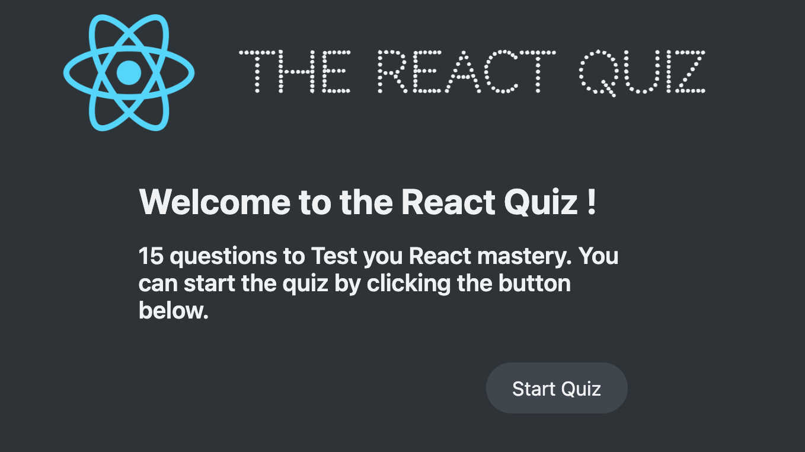

# The React Quiz App




## How to run this App:

## Instructions

1. Installing dependencies listed in package.json.

```
$ pnpm i 
 
```
2. Adding json-server (to fake API).

```
$ pnpm i json-server

- adding script to package.json

"scripts":{
  "server": "json-server --watch data/cities.json --port 8000 -dela;y 500"
},

```


3. Starting up Json-Server:
 - server URL: data/questions.json --port 8000

```
$ pnpm run server 
```


4. Starting up the React App 

```
$ pnpm run start
```

